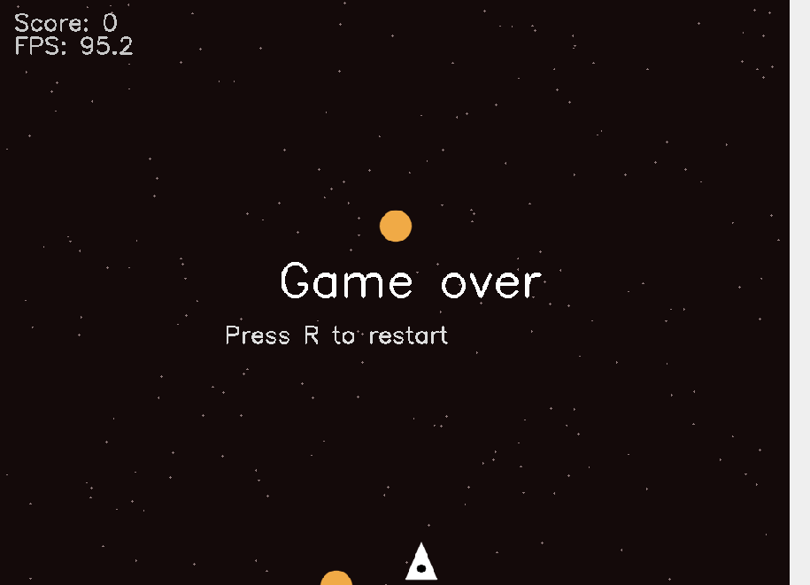
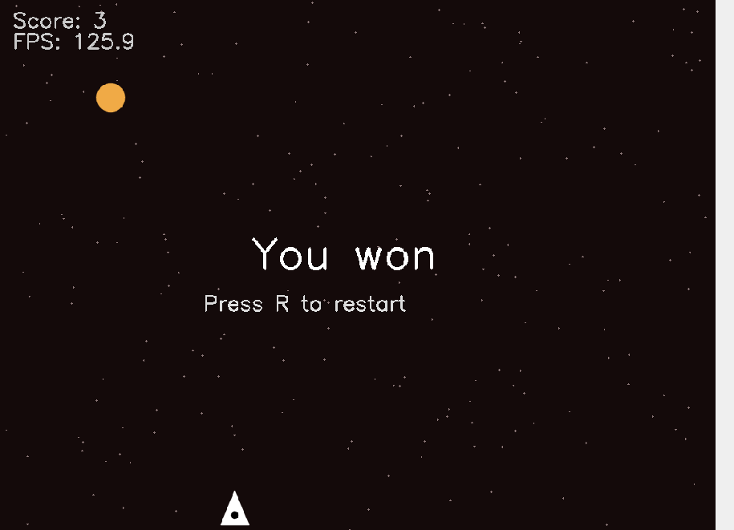

# 🛰️ Space Defender

**Space Defender** je mini 2D arkadna igra napisana u **C++** koristeći **OpenCV**.  
Cilj igre je da oboriš dovoljno asteroida pre nego što oni stignu do dna ekrana.  

Implementirane su dve verzije:
- **Serijska (Sequential)** — cela logika igre u jednoj niti.
- **Paralelna (Parallel)** — više niti: svaka nit pomera svoj asteroid + posebna nit za avion.

---

##  Kontrole

- `A` / `←` : pomeranje levo  
- `D` / `→` : pomeranje desno  
- `W` / `SPACE` : pucaj  
- `R` : restart igre  
- `ESC` / `Q` : izlaz iz igre  

 Prozor ostaje otvoren i nakon **Game Over / You won**, sve dok ne pritisneš `ESC/Q` ili ga sam ne zatvoriš.

---

##  Struktura projekta

```
SpaceDefender/
├── sequential/          # Serijska implementacija
│   ├── main.cpp
│   └── Makefile
├── parallel/            # Paralelna implementacija
│   ├── main.cpp
│   └── Makefile
├── images/              # Screenshots
│   ├── game_over.png
│   └── you_won.png
└── README.md
```

---

##  Build i pokretanje

### 1. Instalacija OpenCV
Na Linuxu (Debian/Ubuntu):
```bash
sudo apt install libopencv-dev
```

### 2. Serijska verzija
```bash
cd sequential
make
./space-defender-seq --asteroids 5 --target 30 --width 1024 --height 768
```

### 3. Paralelna verzija
```bash
cd parallel
make
./space-defender-par --asteroids 8 --target 40 --width 1280 --height 720
```

---

##  Argumenti komandne linije

- `--asteroids N`  → broj asteroida (min 2)  
- `--target N`     → broj pogodaka za pobedu (min 1)  
- `--width W`      → širina prozora (min 400)  
- `--height H`     → visina prozora (min 300)  

Primer:
```bash
./space-defender-seq --asteroids 6 --target 25 --width 800 --height 600
```

---

##  Razlike između verzija

### Serijska (Sequential)
- Jedna nit upravlja svime: igrač, asteroidi, metci, kolizije i crtanje.  
- Jednostavna implementacija, pogodna za manji broj objekata.  

### Paralelna (Parallel)
- **Niti asteroida**: svaka nit pomera jedan asteroid.  
- **Nit aviona**: obrađuje input (levo/desno/pucaj) i generiše metke.  
- **Glavna nit**: tastatura, kolizije, iscrtavanje i FPS overlay.  
- Bolje performanse kod većeg broja objekata.  

---

##  Performanse

Obe verzije prikazuju **FPS overlay** u gornjem levom uglu ekrana.  
Na većim rezolucijama i sa više asteroida vidi se razlika u opterećenju CPU-a.  

---

##  Screenshots

### Game Over


### You Won


---

##  Zahtevi

- **C++17** ili noviji  
- **OpenCV 4.x**  
- Radi na Linux/Windows/macOS (testirano na Linuxu)  

  
